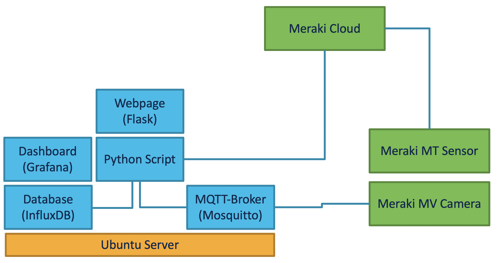

Getting Insights with Meraki Cameras and Sensors
=====================================
This real showcase from the Cisco Frankfurt office highlights the possibilities of the Meraki MV cameras and Meraki MT sensors.

Currently there are 2 use-cases in one Python application implemented:

* **Person detection within pre-defined zones**: If one or more persons are standing within the pre-defined zone (setting in the Meraki-dashboard), the camera is sending out an MQTT message to the python script. Then, only if the person stays for at least x seconds, the data (how many persons, what timeframe, for how long) will be stored in a time-series database.
* **Open/Close MT20 Sensor + Meraki Camera Snapshot**: The webapp shows who has opened the door. It requests the last x events from the Open/Close Meraki MT20 sensor and downloads snapshots from the time where the sensor has been triggered (=door was opened) from a Meraki MV camera.

## Related Sandbox

[Meraki Always On](https://devnetsandbox.cisco.com/RM/Diagram/Index/a9487767-deef-4855-b3e3-880e7f39eadc?diagramType=Topology) (basic functionality to get you started)

## Links to DevNet Learning Labs
[Meraki MV Sense](https://developer.cisco.com/learning/lab/meraki-08-mv-sense/step/1)